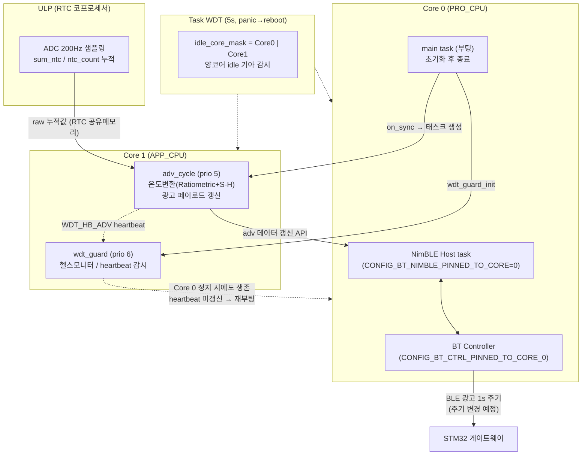

# ESP32-S3 듀얼코어 태스크 아키텍처 (2026-07-18)

앱 태스크를 Core 1로 분리해 BLE 스택(Core 0)과의 경합을 제거하고,
워치독 모니터를 Core 1에 두어 크로스코어 감시를 구성했다.

- `app_main.c:60` — `adv_cycle` → `xTaskCreatePinnedToCore(..., 1)`
- `wdt_guard.c:217` — `wdt_guard` → `xTaskCreatePinnedToCore(..., 1)`
- `CONFIG_FREERTOS_UNICORE` 미설정(듀얼코어), TWDT `idle_core_mask`는 양코어 감시

## 감시 계층 요약

| 계층 | 대상 | 동작 |
|---|---|---|
| wdt_guard (Core 1, prio 6) | ADV heartbeat 15s | 미갱신 시 재부팅 |
| Task WDT 5s | 양코어 idle 기아 | panic → 재부팅 |
| 크로스코어 | Core 0(BLE 스택) 전체 정지 | Core 1 모니터 생존 → 감지 |

우선순위: Core 1 안에서 wdt_guard(6) > adv_cycle(5) — adv가 spin해도 감시 유지.
