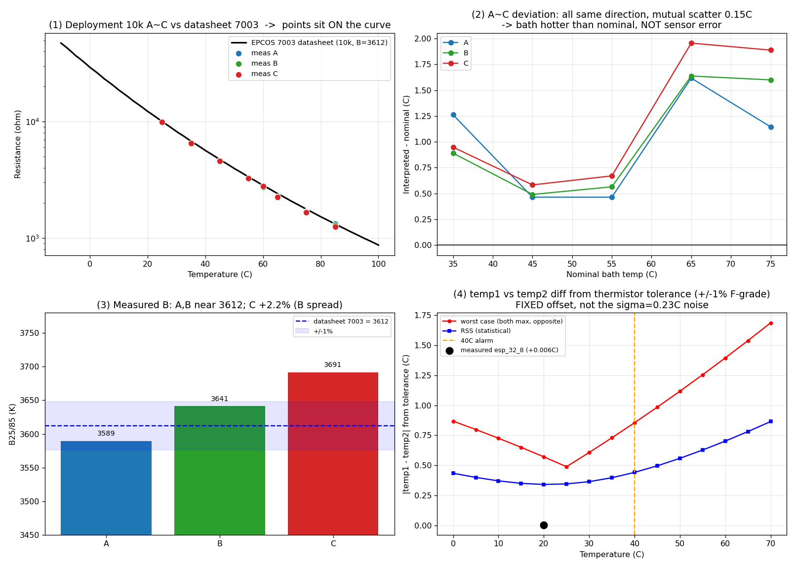

# 02. 데이터시트 정합 + temp1/temp2 채널 오차 (배포용 10k A~C)

작성일: 2026-07-07
대상: 배포용 10k 써미스터 A~C (EPCOS **B57541G1103F000, R/T 특성 8307, B25/85=3478**)
데이터: `result.xlsx`(항온수조 25/60/85 + 검증 35~75℃, 저항 직접측정),
`ingps_sensor_esp_32_8_20260707_165600.csv`(ESP 출력)
그래프: `datasheet_vs_measured.png`

> ⚠️ **정정(2026-07-08): 부품은 8307(B25/85=3478)이며 7003 아님.** 부품번호 F000=8307 확정.
> 아래 §1~2의 "7003(3612) 정합" 결론은 **result.xlsx의 60/85℃ 앵커 열평형 미도달로 측정 B가
> 부풀려진 착시**였다(측정 B 3589~3691 > 실제 3478; 85℃ 욕조가 실제 더 뜨거워 B 과대추정).
> 라이브 데이터 temp2의 겉보기저항이 8307 곡선에 **+0.0%로 정확 정합**해 8307을 확정.
> 아래 측정 수치 자체는 유효하나 **곡선 귀속은 8307로** 읽을 것. 그래프도 7003 기준이라
> superseded. 최신 정본은 `03_추종검증_5단계_실험설계_및_목표잔차.md` 및 07-08 라이브 분석.

> 주: 5k군 D~H는 배포와 무관한 다른 부품이므로 본 문서에서 제외.

---

## 1. 데이터시트 정합 — 부품은 데이터시트대로다

| 센서 | R25 (Ω) | R25 편차 (vs 10k) | B25/85 실측 | vs 7003(3612) |
|---|---|---|---|---|
| A | 9935.5 | −0.6 % | 3589 | −0.6 % |
| B | 9941.4 | −0.6 % | 3641 | +0.8 % |
| C | 9958.3 | −0.4 % | 3691 | +2.2 % |

- R25는 셋 다 −0.4~−0.6 %로 **±1 %(F등급) 공차 안쪽** → 그래프(1)에서 측정점이
  데이터시트 곡선 위에 그대로 앉는다.
- B값은 A·B가 3612에 근접, C만 +2.2 %(개체 산포).

## 2. 검증점 잔차는 센서가 아니라 욕조 (그래프 2)

검증점 35~75℃에서 측정저항을 7003 곡선으로 역산하면 공칭 대비 +0.5~1.7℃
편향이 나온다. 그러나 **세 센서가 모두 같은 방향**이고 상호 산포는 0.15℃뿐이다.
센서 개체 문제라면 제각각 흩어져야 하므로, 이 편향은 **욕조가 공칭 설정값보다
실제 더 뜨거웠던 것**이다. → 재측정 시 공칭값 대신 기준계 실측 온도를 진리값으로
기록해야 함(§ 추종검증 프로토콜).

## 3. temp1 ≠ temp2 — 써미스터 공차만으로 날 수 있는 차이 (그래프 4)

같은 보드의 두 써미스터가 **부품 공차만으로** 벌어질 수 있는 온도차
(ADC·분압은 동일 가정, ±1 % F등급 기준):

| 온도 | 단일센서 오차(RSS) | **두 센서 차이 worst** | 두 센서 차이 RSS |
|---|---|---|---|
| 20 ℃ | ±0.24 ℃ | **±0.57 ℃** | ±0.34 ℃ |
| 25 ℃ | ±0.25 ℃ | **±0.49 ℃** | ±0.35 ℃ |
| 40 ℃ (경보) | ±0.31 ℃ | **±0.86 ℃** | ±0.44 ℃ |
| 55 ℃ | ±0.44 ℃ | **±1.25 ℃** | ±0.63 ℃ |

읽는 법: R25 ±1 %는 전 구간에서 ~0.24~0.30℃ 기여, B ±1 %는 25℃에서 0이고
고온으로 갈수록 커진다(40℃ 0.16℃, 55℃ 0.33℃). 그래서 **경보대역(40℃)에서
두 채널이 써미스터 공차만으로 최대 ±0.86℃, 통계적으로 ±0.44℃ 벌어질 수 있다.**

### 중요: 이 차이는 "고정 오프셋"이지 노이즈가 아니다

- 위 공차 차이는 **DC 오프셋**(시간에 안 변함). 앞서 관측된 순간 흔들림
  σ=0.23℃는 이게 아니라 **ADC 랜덤 노이즈**다(→ `01_노이즈_베이스라인` §3-1).
- 실측 esp_32_8의 temp1−temp2 평균 오프셋은 **+0.006℃**로 사실상 0 →
  이 보드의 두 부품은 우연히 잘 맞았다.
- 다만 실측 A/B/C 3개 개체의 실제 B 산포는 2.8 %(공칭 ±1 %보다 큼)라,
  개체 조합에 따라 **40℃에서 최대 0.38℃**까지 벌어질 수 있음을 확인
  (25℃에선 0.06℃).

### 정리

- **써미스터 공차 기여**: 상온 최대 ~0.5℃, 40℃ 최대 ~0.86℃(worst) / ~0.44℃(RSS).
  고정 오프셋 형태.
- **ADC 노이즈 기여**: σ 0.23℃, 시간에 따라 흔들림. 오버샘플링(√N)으로 저감.
- 두 원인은 성격이 달라 대책도 다르다: 공차→센서별 S-H 계수(오프셋 흡수),
  노이즈→오버샘플링/HW 디커플링.

## 4. 출처

- `result.xlsx` (항온수조 25/60/85 + 검증 35~75℃, 저항 직접측정)
- `ingps_sensor_esp_32_8_20260707_165600.csv` (ESP 펌웨어 출력)
- EPCOS B57541G1 데이터시트 (부품 B57541G1103F000 = R/T 특성 **8307**, B25/85=3478, ±1 % F등급) — `28-B57541G1103F005.pdf` 보관본(전 특성표 수록)
- 계산: `datasheet_compare.py`, `noise_analysis.py` (Cramer + numpy 이중검증)
