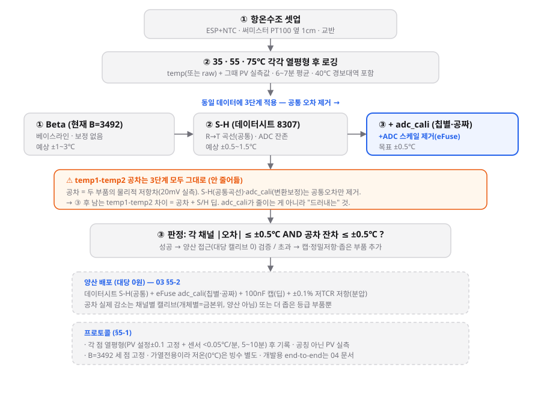

# 03. 추종 검증 — 실험 설계 + 목표 잔차 근거

작성일: 2026-07-07 (07-08 3단계 양산검증으로 재설계)
목적: 항온수조에서 ESP32가 기준온도를 얼마나 정확히 따라가는지를, **양산 가능한 보정
(공통 S-H + 공짜 칩별 adc_cali)이 ±0.5℃를 맞추는지** 단계적으로 검증. 목표 잔차는 오차 버짓으로 근거화.
대상: 배포용 10k A~C (EPCOS **B57541G1103F000**, R/T 특성 **8307**, B25/85=**3478** · B0/100=3450 · B25/100=3492, ±1% F등급). ※ 07-08 정정: 이전 7003(3612)은 오류 — 부품번호 F000=8307 확정, live temp2가 8307 곡선에 정확 정합.
연계: `01_노이즈_베이스라인`, `02_데이터시트_비교_및_채널오차`,
`IN_GPS/Docs/Reference/NTC_ADC_선행연구_해결사례.md`

---

## 1. 실험 흐름



**35/55/75℃ 각 점에서 열평형 후 로깅**하고, **3단계(① Beta → ② 데이터시트 S-H → ③ +adc_cali)**
로 정확도를 측정한다. 각 단계는 **공통 오차**(곡선·ADC 스케일)를 제거하며, temp1-temp2 **공차는
어느 단계로도 줄지 않는다**(§3). 목적은 "양산 접근이 ±0.5℃를 맞추고, 남은 공차(+딥)가 예산 내인지" 검증.
경보 40℃를 35~75 범위가 포함. (개발용 end-to-end 개체 S-H는 §3 참고·04 문서.)

## 2. 오차원(源) 버짓 — 모든 목표 잔차의 근거

40℃(경보대역) 단일센서 기준, 각 요인의 독립 기여. 계산: `datasheet_compare.py` 등.

| 오차원 | 크기(@40℃) | 성격 | 근거/출처 |
|---|---|---|---|
| **원래 펌웨어 Beta(B=3950) 모델오차** | −2.09℃(@40) ~ −7.0℃(@75) | 계통 | B=3950 ≠ 실제 8307(B25/85=3478). 계산. **출발점** |
| Beta(B=3450) 모델오차 (8307 최적 단일 B) | 0~55℃ 최대 0.62℃(@0), −0.13℃(@40) | 계통 | 단일 B 곡률 근사 한계. 계산. (현 펌웨어 3492는 최대 0.89℃) |
| S-H 모델오차 (3점 적합) | <0.01℃ | 계통 | §01·데이터시트 표 적합 잔차 |
| NTC R25 공차 ±1% | ±0.27℃ | 계통(개체) | EPCOS B57541G F등급 [DS] |
| NTC B 공차 ±1% | ±0.16℃ | 계통(개체) | EPCOS B57541G [DS] |
| 분압저항 공차 ±1% | ±0.27℃ | 계통 | 저(低)TCR 정밀저항 사양 [ADI] |
| **ADC 스케일(Vref) 미보정** | **±3.9℃ (±5%), 최악 ±7.3℃ (±9%)** | 계통 | ESP32 Vref 1000~1200mV [ESP-CAL] |
| ADC 스케일 adc_cali 후 ~±1% | ±0.76℃ | 계통 | eFuse 캘리브레이션 잔차 [ESP-CAL] |
| **자기발열** | **+0.50℃** | 계통(일방향) | δth≈0.5mW/K [DS], P=V²/R 계산 |
| 랜덤 노이즈 (1샘플) | σ 0.27℃ | 랜덤 | §01 실측 |
| 랜덤 노이즈 (오버샘플 200) | σ 0.08℃ | 랜덤 | 이전 실측(√N) |
| 양자화 1LSB/√12 | 0.006℃ | 랜덤 | 1LSB=21.6m℃ 계산 |
| **기준(항온수조 WB-6 PresentValue)** | 제어 ±0.1℃ / **균일도 ±1.0℃** | 검증 바닥 | WB-6 사양: PT100·±0.1℃·균일도 ±1.0℃ [WB-DS]. 실효=균일도 지배 |

핵심: **ADC 스케일이 전 오차를 압도**(부품 공차 총합 ±0.4℃ vs ADC ±3.9℃). 그래서
ADC를 제거하는 M4 단계에서 최대 개선이 나와야 한다.

## 3. 실험 계획 — 3단계 양산검증 (07-08 재설계)

> 재설계 배경: 양산에선 **대당 수조 캘리브(개체별 end-to-end)가 불가능**. 그래서
> **양산 가능한 접근(공통 계수 + 공짜 칩별 보정)이 ±0.5℃를 맞추는지 검증**하는 3단계로 축소.
> 각 단계는 항온수조 35/55/75℃에서 **정확도를 측정**(계수 피팅이 아니라 검증 측정).

| 단계 | 펌웨어 | 잡는 것(공통 오차) | temp1-temp2 **공차** | 예상 잔차 |
|---|---|---|---|---|
| **① Beta** | 현재(B=3492) | 없음(베이스라인) | 그대로 | ±1~3℃ |
| **② S-H(데이터시트)** | 8307 S-H 계수(공통) | R→T 곡선 | **그대로** | ±0.5~1.5℃(ADC 잔존) |
| **③ +adc_cali** | ②+eFuse 보정 | +ADC 스케일(칩별, 공짜) | **그대로(=이제 잔차 주범)** | **±0.5℃ 목표** |

### ⚠️ 공차에 대한 핵심 (오해 주의)

**세 단계 중 어느 것도 Thermistor 간 공차를 "줄이지" 않는다.** 공차는 두 부품의
**물리적 저항차**(20mV 실측 확인)이고, S-H(공통 곡선)·adc_cali(유닛 공통, 변환 보정)는
**공통 오차만** 제거한다. → **+adc_cali 후 남는 temp1-temp2 차이 = 공차(+S/H 딥).**
adc_cali는 공차를 줄이는 게 아니라 **다른 오차를 다 치워 공차를 드러낼 뿐.**

**공차를 실제로 줄이려면:** 채널별 캘리브(개체별, 양산 회피 대상) 또는 **더 좁은 등급
부품**. 3단계로는 안 줄어듦. → 3단계 실험의 목적은 "**남은 공차(+딥)가 ±0.5℃ 안에
드는지 확인**"이다(줄이는 게 아니라 예산 내인지 검증).

### 판정
- ③ 후 각 채널 |오차| ≤ ±0.5℃ **그리고** temp1-temp2 공차 잔차 ≤ ±0.5℃ → **양산 접근 검증 성공**(채널별 캘리브 불필요).
- 초과 → 추가 레버: **100nF 캡**(딥), **±0.1% 저TCR 분압저항**, **더 좁은 써미스터 등급** 또는 벤더 개체캘리 부품.

### 참고: end-to-end 개체 S-H (금본위, 양산 아님)
개발/검증용으로 채널별 raw→기준온도 S-H를 별도로 떠서(→ `04_end_to_end_SteinhartHart_방법.md`)
"이론상 최대 정확도"를 재고, 위 3단계(양산 접근)가 여기에 얼마나 근접하는지 비교하는 **기준**으로 쓴다.

### ② 단계용 8307 데이터시트 S-H 계수 (전 제품 공통)
표(8307, p7)에서 앵커 5/45/85℃로 산출, 0~85℃ 모델오차 <0.002℃:
```
A = 8.4793516e-04
B = 2.6109321e-04
C = 1.2966573e-07
```
런타임: `T = 1/(A + B·lnR + C·(lnR)³) − 273.15` (R = 겉보기저항). 채널 공통(개체 아님).

## 4. 목표값 정리 (수용 기준)

| 항목 | 목표 | 근거 |
|---|---|---|
| 최종 정확도 (M5, 경보대역) | **|오차| ≤ ±0.5℃** | 기준계 정확도가 바닥. 그 이하는 검증 불가 |
| 경보 임계(40℃) 판정 오차 | **≤ ±0.5℃** | 과열 오·미검출 방지 실용 요구 |
| 노이즈 (오버샘플 적용) | **σ ≤ 0.1℃** | 이전 실측 0.08℃(√N) |
| temp1-temp2 채널 일치 | **≤ ±0.3℃** | 부품공차 RSS(§02) + 오버샘플로 랜덤 제거 |
| 자기발열 목표 | **≤ 0.13℃** (공차의 25%) | IEC 60751 25% 규칙 [TDK]. 현재 0.5℃ → 개선 대상 |

## 5. 전제 조건 (목표 달성 필수)

1. **오버샘플링 복원**: M4/M5 목표는 σ≤0.1℃ 가정. 1샘플(σ0.27→3σ0.8℃)이면 목표 미달.
   ULP `sum_ntc` 창평균 소비 코드 복원 필요.
2. **자기발열·열매질 정합**: 항온수조(물, δth 높음)는 자기발열이 공기보다 작다. 배포가
   공기 중이면 수조 교정이 자기발열을 과소보정 → **배포와 같은 매질에서 교정하거나
   δth 차이를 보정**. [TDK §2.1]
3. **기준계 실측값 사용**: 공칭 설정값 금지(§02에서 욕조 +0.5~1.7℃ 편향 확인).
4. **raw 로깅**: 펌웨어가 raw NTC 카운트 출력(이미 UART `raw ntc1=` 존재) → 1런 5변환.

## 5-1. 항온수조(WB-6) 운용 기준 — 근거 포함

사용 장비: **WB-6 워터배스, 6 L, 800 W, PT100, 디지털 퍼지 컨트롤**. [WB-DS]

### A. 기준온도 신뢰 조건 — 균일도가 병목 (배치)
- 스펙에 정확도 숫자가 둘: **정확도 ±0.1℃**(PT100 위치의 제어 정확도)와
  **균일도 ±1.0℃**(수조 내 공간 편차).
- PresentValue는 PT100 지점 온도. 우리 센서는 다른 위치 → **균일도 ±1.0℃가 실효
  기준 불확도**가 된다(±0.1℃가 아님). 이대로면 M5 목표(±0.5℃) 검증 불가.
- **근거(실측 정합)**: `result.xlsx`의 A~C가 검증점에서 +0.5~1.7℃로 **같은 방향** 편향
  (상호 산포 0.15℃, §02) → 센서가 PT100보다 뜨거운 자리에 있었음 = 균일도 ±1.0℃와 일치.
- **대책**: 써미스터를 **PT100 프로브 바로 옆·같은 깊이**에 밀착 + **교반/순환** 확보 →
  실효 기준 불확도 ~±0.2~0.3℃. 가능하면 국소 기준프로브로 PresentValue와 교차검증
  (0.2℃ 내 일치 확인 시 그 지점 신뢰).

### B. 온도 범위 제약
- WB-6은 **가열 전용, ambient+5℃ ~ 100℃**. [WB-DS]
- **0℃·실온 이하 앵커 불가** → 저온점은 **빙수(0℃) 별도** 또는 실온 이용. 40~90℃
  (경보 40℃ 포함)는 이 수조로 커버. → M1~M5 앵커/검증점을 40~90℃ 위주로 재배치.

### C. 대기 시간 — "몇 시간"이 아니라 "읽값이 멈출 때까지"
두 시계가 다르다.

1. **수조 도달·정착 (지배 시간)**: Q=m·c·ΔT, 6 L·800 W 기준 이상 가열시간(실제 손실 ~1.5배):
   20→40℃ ~16분, 20→60℃ ~31분, 20→85℃ ~51분. **스텝업**(40→60→85)이면 각 20분 안팎.
   + 퍼지 컨트롤러 오버슛 정착 10~30분. → **찬물 첫 고온점 최대 1~1.5 h, 이후 점 20~40분.**
2. **센서 열평형 (짧음)**: EPCOS τc≈4 s(공기), 물속 더 빠름 [DS]. PCB/하우징 열질량
   고려해도 τ~1~2분 → 5τ(>99%) = **5~10분**.
- 결론: **2 h는 과잉.** 지난 60/85℃의 10%(≈3℃) 저항 산포는 시간 부족이 아니라
  **정착 전 측정**이 원인으로 추정.
- **판정 기준(시계 금지, 데이터로 게이팅)**: PresentValue가 설정값 **±0.1℃** 안에서 고정
  **AND** 센서 변화율 **<0.05℃/분**(저항 <0.1%/분)이 **5~10분** 유지 → 그때 기록 시작.
- **⚠️ 하우징(원형 통) 지연**: 써미스터가 통(열질량) 안에 있어 물 온도를 분 단위로 뒤늦게
  추종(5τ≈10~20분, 맨써미스터보다 훨씬 김). **게이팅은 물 PV가 아니라 써미스터 읽값 flat 기준**으로,
  통 때문에 더 오래 기다릴 것. **미평형에서 기록 시 캘리 점 오염**(지연은 캘리로 흡수 불가, 평형 대기로만 제거).
  정상상태 오프셋(통 노출부↔상온 열흐름)은 end-to-end 캘리가 흡수 가능(셋업 일관 시). 통은 배포 하우징과
  유사해 현실적이나, **캘리 매질(물)≠배포 매질이면 자기발열·지연 특성 상이** 주의.

### 계산 근거 요약
`Q=m·c·ΔT` (m=6 kg, c=4186 J/kg·K, P=800 W), τc·δth는 EPCOS B57541G 데이터시트,
균일도·범위·정확도는 WB-6 사양표. 계산 스크립트: 세션 산출(heating time, τ).

## 5-2. 양산 배포 전략 (대당 캘리브 0)

핵심: "수조 개체별" vs "데이터시트만"의 이분법이 아니다. 사이에 **공짜 칩별 보정(eFuse adc_cali)** 이 있다.

| 오차원 | 양산 대책 | 대당 비용 |
|---|---|---|
| R→T 곡선 | **데이터시트 S-H(8307, 공통 계수)** | 0 |
| ADC 스케일(칩별) | **eFuse adc_cali** — Espressif 공장 교정, SW 적용만 | **0** |
| S/H 딥 | **100nF 바이패스 캡** | BOM만 |
| 분압 공차 | **±0.1% 저TCR 저항** | BOM만 |
| 써미스터 공차 | ±1%(F)≈±0.3℃ 수용 / 더 좁은 등급 / 벤더 개체캘리 부품(TDK B57868S) | 0~부품비 |

→ **대당 수조 캘리브 없이 ~±0.3~0.5℃** 기대. 개체 변동의 최대 원인(ADC)은 eFuse가 공짜로,
딥은 캡이, 분압은 정밀저항이 잡고 남는 건 써미스터 공차뿐.

**주의:** "데이터시트 S-H"가 개체 변동을 줄이는 게 아니라 **대당 작업을 안 하는 것**뿐이다.
개체 변동을 실제로 줄이는 건 adc_cali + 정밀저항 + 캡(+좁은 부품). datasheet S-H 단독이면
~1℃ 남고, 여기에 얹어야 ±0.5℃. **역할분담:** 개발=end-to-end(금본위 측정), 양산=datasheet S-H+adc_cali+캡+저항.

## 6. References (전거 — 확정본)

### 6-1. 1차 부품·데이터시트
- **[DS] EPCOS/TDK B57541G1 데이터시트** (2016) — R/T 특성표 **8307(10k, B25/85=3478 · B0/100=3450 · B25/100=3492)**,
  δth≈0.5mW/K, R25 공차 ±1/±2/±3%(F/G/H). 부품 **B57541G1103F000=8307**. 보관본: `28-B57541G1103F005.pdf`(전 특성 표 수록)
- **10k B3950 R-T 표** (Adafruit 보관본) — https://cdn-shop.adafruit.com/datasheets/103_3950_lookuptable.pdf
  (Beta vs S-H 모델비교 §01 진리값)
- **[WB-DS] 항온수조 WB-6 사양표** (Technical Information, Korean 매뉴얼 p.9) —
  Temp. Range & Accuracy: ambient+5~100℃, ±0.1℃ · Temp. Uniformity & Probe: ±1.0℃, PT100 ·
  Resolution 0.1℃ · Heating 800 W · 6 L. (§5-1 기준온도 신뢰·범위·대기시간 근거)

### 6-2. ADC·측정 회로 (해결기법 근거)
- **[ADI] Analog Devices AN-1753, *A Simple Thermistor Interface to an ADC*** —
  https://www.analog.com/en/resources/design-notes/a-simple-thermistor-interface-to-an-adc.html
  (ratiometric: Vref 상쇄. 분압저항 저TCR 요구)
- **[TDK] TDK Electronics, *Digital Readout of NTC Thermistors: Circuit Optimization*** (2024) —
  https://www.tdk-electronics.tdk.com/download/3229242/813b1afa3fb473d7a434b927186744b2/ntc-thermistors-readout-optimization-an.pdf
  (ESP32+외부 ADC, 자기발열 IEC 60751 25% 규칙, S-H 최정확, 개체 캘리브레이션, EMI 실드, GUM 버짓)
- **[ESP-CAL] Espressif ADC Calibration Driver (ESP32-S3)** —
  https://docs.espressif.com/projects/esp-idf/en/latest/esp32s3/api-reference/peripherals/adc/adc_calibration.html
  (Vref 1000~1200mV 편차, eFuse 캘리브레이션, "Minimize Noise" 100nF+멀티샘플링)
- **Espressif, *Comparing ADC Performance of Espressif SoCs*** (2025) —
  https://developer.espressif.com/blog/2025/08/adc-performance/
- **[ULP] Espressif ULP RISC-V Coprocessor (ESP32-S3)** —
  https://docs.espressif.com/projects/esp-idf/en/latest/esp32s3/api-reference/system/ulp-risc-v.html

### 6-3. 노이즈 저감·캘리브레이션 기법
- **Microchip/Atmel AVR121, *Enhancing ADC Resolution by Oversampling*** (오버샘플+데시메이션 √N)
- **e-tinkers/esp32-adc-calibrate** — https://github.com/e-tinkers/esp32-adc-calibrate (LUT/다항식 ADC 보정)
- **nedesico/ESP32_Thermistor** — https://github.com/nedesico/ESP32_Thermistor (셀프 레퍼런스 캘리브레이션)
- **[ESP-HW] Espressif ESP32-S3 Hardware Design Guidelines** —
  https://docs.espressif.com/projects/esp-hardware-design-guidelines/en/latest/esp32s3/esp-hardware-design-guidelines-en-master-esp32s3.pdf (디커플링/레일 분리)

### 6-4. 오차·불확도 방법론
- **[GUM] JCGM 100:2008**, *Evaluation of measurement data — Guide to the expression of
  uncertainty in measurement* (RMS 합성)
- **IEC 60751** — 자기발열 오차 ≤ 센서 공차 25% 기준 (TDK 인용)
- Power Electronic Tips, *Error analysis in temperature sensing with NTC/PTC thermistors* —
  https://www.powerelectronictips.com/error-analysis-temperature-sensing-ntc-silicon-based-ptc-thermistors/

### 6-5. 사내 산출물 (재현 스크립트·데이터)
- `result.xlsx` (항온수조 25/60/85 + 검증 35~75℃, 저항 직접측정, 센서 A~H)
- `ingps_sensor_esp_32_8_20260707_165600.csv` (ESP 1샘플 실측, 노이즈 베이스라인)
- 스크립트: `datasheet_compare.py`, `noise_analysis.py`, `calib_analysis.py`
  (Cramer + numpy `linalg.solve` 이중검증)
- 그래프: `datasheet_vs_measured.png`, `noise_baseline_esp32_8_20260707.png`
- 연계 분석: `01_노이즈_베이스라인_esp32_8.md`, `02_데이터시트_비교_및_채널오차.md`,
  `IN_GPS/Docs/Reference/NTC_ADC_선행연구_해결사례.md`
