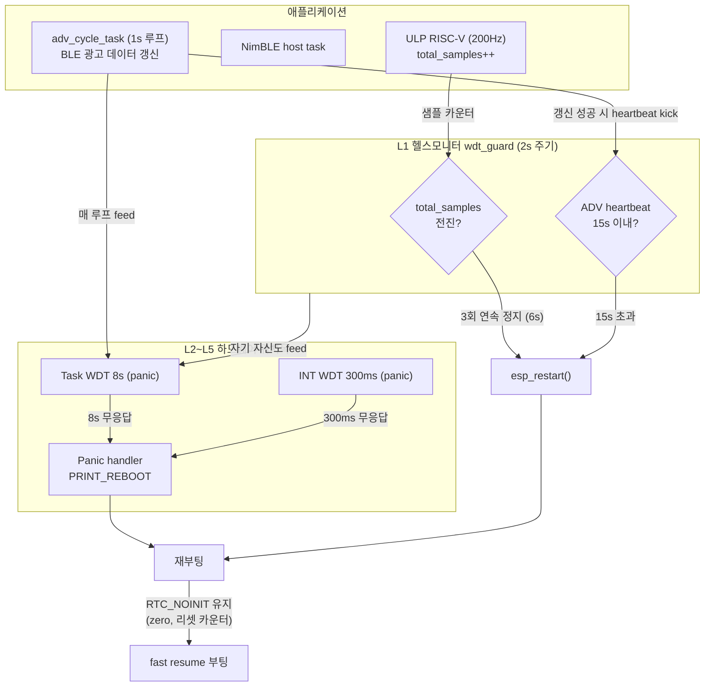
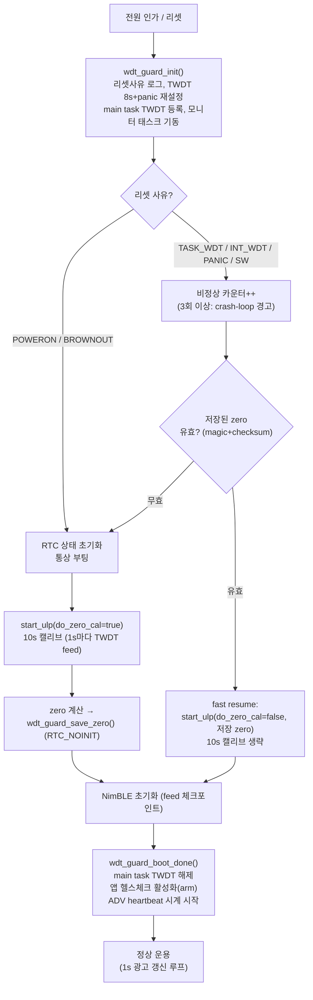
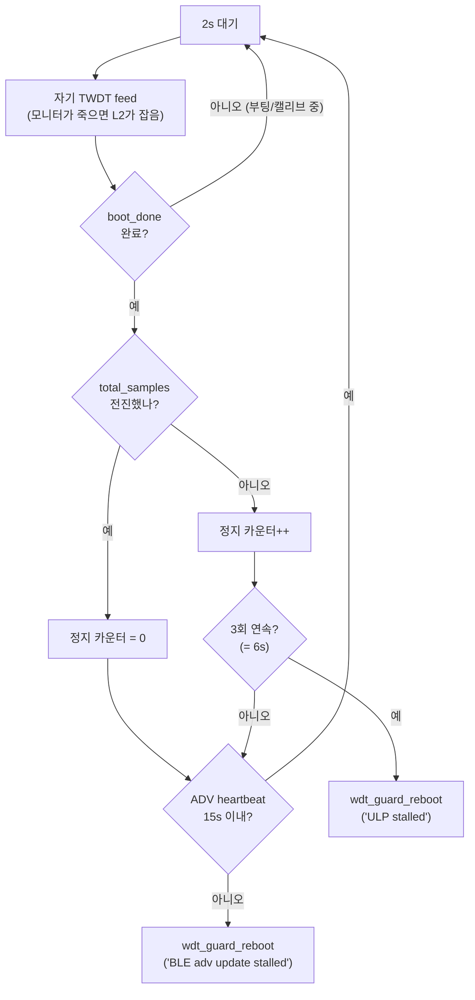

# IN_GPS 워치독(Watchdog) 설계 — "어떤 상황에서도 계속 돌아가는" 자가복구 구조

작성: 2026-07-18 · 대상: ESP32-S3 + ESP-IDF v5.5.2 · 요구사항: 측정값 1초 주기 BLE 송신을 무인 상태에서 무기한 유지

---

## 1. 배경 — 기존 펌웨어의 구멍 3개

| # | 기존 상태 | 결과 |
|---|-----------|------|
| 1 | `CONFIG_ESP_TASK_WDT_PANIC` 미설정 | Task WDT가 걸려도 **경고 로그만 출력**하고 리셋 안 함 — 멈춘 태스크는 계속 멈춰 있음 |
| 2 | `CONFIG_ESP_SYSTEM_PANIC_PRINT_HALT=y` | 크래시(panic) 시 **재부팅 대신 영구 정지** — 진단엔 좋지만 무인 운용 시 벽돌 |
| 3 | 앱 레벨 감시 없음 | ULP 정지(HW WDT 사각지대), adv 태스크의 조용한 사망(`vTaskDelete` 후 종료), NimBLE 스택 고장을 **아무도 감지 못함** |

이번 설계는 위 구멍을 막고, HW 워치독이 못 보는 영역(ULP 코프로세서, "태스크는 도는데 논리적으로 죽은" 상태)까지 감시하는 5계층 구조를 도입한다.

---

## 2. 보호 계층 (L1이 가장 먼저, L5가 마지막 방어선)

| 계층 | 감시 주체 | 감시 대상 | 타임아웃 | 발화 시 동작 | 구현 위치 |
|------|-----------|-----------|----------|--------------|-----------|
| L1 | 헬스모니터 태스크 (`wdt_guard`) | ULP `total_samples` 전진, BLE 광고 갱신 heartbeat | ULP 6s / ADV 15s | 사유 로그 → `esp_restart()` | `main/watchdog/wdt_guard.c` |
| L2 | Task WDT (TWDT) | 등록 태스크(부팅 중 main, `adv_cycle`, 모니터 자신) + 양코어 idle | 8s | panic → 재부팅 | `wdt_guard_init()`에서 재설정 |
| L3 | Interrupt WDT | ISR/스케줄러 정지 (양코어) | 300ms | panic → 재부팅 | sdkconfig |
| L4 | Panic handler | 모든 panic (assert, LoadProhibited, WDT panic...) | 즉시 | **PRINT_REBOOT** (변경됨) | sdkconfig |
| L5 | 부트로더 RTC WDT | 부팅 과정 자체 | 9s | 리셋 | sdkconfig (기존 유지) |

보조: Brownout detector(전원 급락 시 리셋, IDF 기본 활성) · 연속 비정상 리셋 카운터(RTC_NOINIT, 3회 이상이면 crash-loop 경고 로그).

---

## 3. 전체 감시 아키텍처



핵심 원칙: **모니터가 죽으면 TWDT가 잡고, TWDT를 못 먹일 정도로 시스템이 망가지면 INT WDT/panic이 잡는다.** 어떤 경로로 죽어도 종착지는 재부팅이다.

---

## 4. 부팅 시퀀스 (fast resume 분기 포함)

비정상 리셋(WDT/panic/자가복구) 후에는 RTC_NOINIT에 보관한 ADXL zero를 재사용해 10초 재캘리브를 생략한다. 광고 재개까지 다운타임 약 11.5s → **약 1.5s**.



`wdt_guard_boot_done()`에서 ADV heartbeat 시계를 미리 arm하므로, **NimBLE sync 자체가 안 와서 광고 태스크가 시작조차 못 하는 경우**에도 15초 뒤 자가 재부팅된다.

---

## 5. 헬스모니터 루프 (L1)



ULP 복구를 "ULP만 재시작"이 아니라 **전체 재부팅**으로 하는 이유: ULP 런타임 재시작에는 미해결 버그가 있고(07-15 딥슬립 재설계 때 확인), 전체 재부팅이 초기화 경로가 결정적이라 안전하다. fast resume 덕분에 재부팅 비용도 ~1.5s로 낮다.

---

## 6. 장애 시나리오 → 감지 계층 매트릭스

| 장애 시나리오 | 감지 계층 | 감지 시간 | 복구 |
|---------------|-----------|-----------|------|
| ULP 코프로세서 정지 (재시작 버그, RTC 도메인 이상) | L1 (샘플 카운터) | ≤ 6s | 재부팅 + fast resume |
| adv 태스크가 NimBLE 호출에서 영구 블록 | L2 (TWDT) | ≤ 8s | panic → 재부팅 |
| adv 태스크는 도는데 `adv_set_data` 계속 실패 | L1 (heartbeat) | ≤ 15s | 재부팅 |
| NimBLE sync가 아예 안 옴 (초기화 실패) | L1 (heartbeat, boot_done에서 arm) | ≤ 15s | 재부팅 |
| 초기 광고 셋업 실패 (encode/set_data/adv_start) | 코드 직접 (`wdt_guard_reboot`) | 즉시 | 재부팅 (구버전: `vTaskDelete`로 조용한 벽돌) |
| 어떤 태스크가 CPU 독점 (무한 spin) | L2 (idle 태스크 기아) | ≤ 8s | panic → 재부팅 |
| ISR/스케줄러 정지 (인터럽트 막힘) | L3 (INT WDT) | ≤ 300ms | panic → 재부팅 |
| NULL 역참조, assert, 스택 오버플로 등 크래시 | L4 (panic handler) | 즉시 | 재부팅 (구버전: 영구 정지) |
| 부팅 과정에서 멈춤 | L2 (부팅 구간 main 등록) + L5 | ≤ 8s / 9s | 재부팅 |
| 전원 급락 | Brownout detector | 즉시 | 리셋 (POWERON 취급, 통상 캘리브) |
| 반복 크래시 (HW 고장, 전원 불량) | 연속 비정상 리셋 카운터 | 3회째부터 | 경고 로그 (송신은 계속 유지) |

---

## 7. 파라미터

전부 `main/watchdog/wdt_guard.c` 상단에 모여 있다.

| 매크로 | 값 | 근거 |
|--------|-----|------|
| `WDT_TWDT_TIMEOUT_MS` | 8000 | adv 루프 1s·BLE_INIT 실측 1.1s 대비 충분한 여유. 캘리브 10s 대기는 1s 단위로 쪼개 feed |
| `WDT_MONITOR_PERIOD_MS` | 2000 | 감시 오버헤드 무시 가능한 수준에서 반응성 확보 |
| `WDT_ULP_STALL_LIMIT` | 3 (=6s) | 200Hz ULP는 2s에 ~390샘플 전진 — 1회만 정지여도 이상이지만 오탐 방지로 3회 |
| `WDT_HB_ADV_STALE_MS` | 15000 | 1s 주기 갱신 기준 15회 연속 실패 = 스택 고장 확정으로 판단 |
| `WDT_CRASHLOOP_WARN` | 3 | 연속 비정상 리셋 경고 임계 |
| `WDT_FAST_RESUME` | 1 | 0으로 빌드하면 항상 10s 캘리브 수행 |

sdkconfig 변경분:

```
CONFIG_ESP_TASK_WDT_PANIC=y            # TWDT 발화 → panic (기존: 경고만)
CONFIG_ESP_SYSTEM_PANIC_PRINT_REBOOT=y # panic → 재부팅 (기존: PRINT_HALT 정지)
CONFIG_ESP_SYSTEM_PANIC_REBOOT_DELAY_SECONDS=0
CONFIG_ESP_BROWNOUT_DET_LVL=5          # 2026-07-18 실기기 테스트 중 BOD 트립 확인 후 7→5 완화
```

### 7-1. Brownout 임계값 완화 (2026-07-18 실기기 이슈)

실기기 테스트(`WDT_TEST_MODE=0`, 정상 빌드) 중 `nimble_port_init()` 직후(BLE 라디오 파워업 타이밍) `E BOD: Brownout detector was triggered`가 실제로 발생해 리셋됨. 이 리셋은 워치독 코드와 무관 — `adv_cycle_task` 시작 전이라 `wdt_guard`/`wdt_test` 어느 쪽도 아직 개입하지 않은 시점. 근본 원인은 [[ingps-progress-2026-07-16]]에서 관찰된 "BLE TX 전류버스트로 추정되는 VCC dip"과 동일 계열로, 이번엔 그 전압강하가 Brownout 임계값을 실제로 넘어선 것으로 판단.

기존 `CONFIG_ESP_BROWNOUT_DET_LVL=7`은 ESP-IDF 기본값이자 **가장 민감한(가장 높은 전압에서 트립되는) 설정**이라, 짧은 순간의 전류 스파이크에도 쉽게 걸린다. 레벨을 5로 낮춰 순간적 전압강하에 대한 여유를 늘림. (정확한 전압 수치는 이 세션에서 IDF 소스 대조로 확인하지 못함 — Kconfig 도움말 또는 실측으로 재확인 권장.)

**주의**: 이건 완화이지 근본 해결이 아니다. Brownout은 우리 워치독 설계상 "정상 리셋"(POWERON과 동일 취급)이라 fast resume이 안 걸리고 매번 10초 풀 재캘리브레이션이 돈다 — WDT/panic 복구(~1.5s)보다 훨씬 비싸다. 이 리셋이 반복 재현되면 레벨을 더 낮추는 것보다 하드웨어(BLE 라디오 근처 벌크 커패시터 추가, 전원 공급/케이블 개선)가 우선이다. 레벨을 과도하게 낮추면 실제로 위험한 저전압에서도 리셋 없이 버티다 플래시 손상 등으로 이어질 수 있음.

### 7-2. 배터리(LS14500) 특성 + 진단모드 잔존 설정 (2026-07-18 후속 조사)

Brownout이 배터리를 4회 교체해도 재현되고, 새 배터리에서도 되다 안 되다 하는 현상을 추가로 조사함. 사용 배터리는 **LS14500(Li-SOCl2, 연속전류 스펙 ~50mA)** — 이 화학종류는 "패시베이션(voltage delay)" 특성이 있어, 가만히 있던 셀에 갑자기 전류 펄스(BLE TX 버스트)가 걸리면 순간적으로 전압이 크게(문헌상 최대 1.8V까지) 주저앉았다가 서서히 회복된다. **새 셀일수록 패시베이션 막이 두꺼워 오히려 더 심하게 나타날 수 있음** — "새 배터리 갈아도 안 됨"과 정합.

여기에 더해, git 이력 확인 결과 `05-18 커밋 ccb0688("Firmware_v2_init_ver")`에서 진단 목적으로 켠 뒤 안 돌아온 설정 2개가 평균 소비전류를 올려 브라운아웃 마진을 깎고 있었음을 확인:

1. `esp_log_level_set("*", ESP_LOG_INFO)` — 매초 UART 로그 출력(원래 배포용 주석: "로그 끄기 = 전류 절감")
2. `esp_pm_config_t{max=160,min=160,light_sleep_enable=false}` — CPU 상시 160MHz 고정, light sleep 없음(원래 코드 주석에 "복귀 시 min=40, light_sleep=true"라고 본인이 남겨둔 걸 안 돌린 상태)

2026-07-18에 두 설정 모두 원복함(`app_main.c`): 로그는 `"*"` NONE으로 내리되 `WDT_GUARD`(INFO)·`WDT_TEST`(WARN) 태그만 살려서 워치독 진단 가시성은 유지. PM은 `min_freq_mhz=40, light_sleep_enable=true`로 복귀.

**미해결 TODO(그대로 남음)**: light sleep 복귀는 원래 "3초 주기 ADC floating" 문제 때문에 껐던 것이고, ULP ADC가 light sleep wake transient에 영향받지 않도록 하는 별도 PM lock/wake-delay 처리는 아직 구현 안 됨. 실기기 테스트 중 raw 로그·캘리브 안정성에서 3초 주기 흔들림이 재발하는지 확인 필요 — 재발하면 그 처리를 추가로 구현해야 함.

**결론**: 브라운아웃은 하드웨어(패시베이션 취약한 LS14500 + 미실장 벌크캡)와 소프트웨어(잔존 진단모드로 인한 높은 평균전류) 두 요인이 겹쳐 마진이 거의 없는 상태였을 가능성이 높음. 로그/PM 원복은 무료(하드웨어 불필요)로 시도 가능한 조치이고, 커패시터 추가는 별도 하드웨어 작업.

---

## 8. 변경 파일 요약

| 파일 | 변경 |
|------|------|
| `main/watchdog/wdt_guard.h` | 신규 — 공개 API (init/feed/subscribe/heartbeat/boot_done/reboot/fast_resume/save_zero) |
| `main/watchdog/wdt_guard.c` | 신규 — TWDT 재설정, 헬스모니터 태스크, RTC_NOINIT 상태(zero+리셋 카운터) |
| `main/app_main.c` | `wdt_guard_init()` 최상단 호출, 부팅 단계별 feed 체크포인트, 캘리브 10s를 1s×10 feed 루프로 분할, fast resume 분기, 말미 `wdt_guard_boot_done()` |
| `main/ble/ble_adv.c` | `adv_cycle_task` TWDT 등록 + 매 루프 feed, 갱신 성공 시에만 heartbeat kick, 초기 셋업 실패 시 `vTaskDelete`(조용한 벽돌) → `wdt_guard_reboot`(즉시 재부팅) |
| `main/CMakeLists.txt` | `watchdog/wdt_guard.c` 추가 |
| `sdkconfig` | 위 7절의 3개 항목 (+ 하위호환 미러 키 `CONFIG_TASK_WDT_PANIC`) |

기존 동작 유지: ULP 측정 경로, BLE 광고 내용/주기, 캘리브 알고리즘은 변경 없음. `start_ulp_adc_measurement(do_zero_cal=false, ...)`는 07-15 딥슬립 재설계 때 만들어 둔 미사용 경로를 fast resume에 재활용한 것.

---

## 9. 검증 방법

빌드: `idf.py build` (sdkconfig 변경으로 전체 재생성됨). 플래시 후 부팅 로그에서 `WDT_GUARD: reset reason=...`과 `WDT_GUARD: armed: TWDT=8000ms...` 확인. 하루 방치 soak 후 `consecutive abnormal resets=0` 유지가 정상운용 기준선.

### 장애 주입 테스트 스위치 (`main/watchdog/wdt_test.h`)

`WDT_TEST_MODE` 숫자 하나만 바꿔 빌드→플래시하면 광고 루프 시작 30초 뒤(`WDT_TEST_TRIGGER_S`) 선택한 장애가 1회 발동한다. **테스트 후 반드시 0으로 원복** (0이 아니면 빌드 때 `#warning`으로 상기).

| MODE | 주입 장애 | 감지 계층 | 기대 시간 | 다음 부팅 reason |
|------|-----------|-----------|-----------|------------------|
| 1 | ULP 타이머 정지 (`ulp_riscv_timer_stop`) | L1 | ≤6s `ULP stalled` | 3 (SW) |
| 2 | ADV heartbeat 억제 (광고는 계속) | L1 | 15s `BLE adv update stalled` | 3 (SW) |
| 3 | 태스크 무한 spin | L2 TWDT | ≤8s `Task watchdog got triggered` | 6 (TASK_WDT) |
| 4 | 인터럽트 정지 + spin | L3 INT WDT | ≤300ms `Interrupt wdt timeout` | 5 (INT_WDT) |
| 5 | NULL 역참조 | L4 panic | 즉시 (백트레이스 후 재부팅) | 4 (PANIC) |

reset reason 값: 1=POWERON, 3=SW(자가복구), 4=PANIC, 5=INT_WDT, 6=TASK_WDT, 9=BROWNOUT.

부팅 구간 감시(캘리브 중 TWDT)는 스위치로 못 만들므로 수동으로: `app_main.c` 캘리브 루프의 `wdt_guard_feed()` 주석 처리 → 캘리브 도중 8s에 TWDT 발화 확인.

### 재부팅 후 확인 포인트

fast resume: 어느 테스트든 재부팅 직후 `[fast resume]` + `WDT recovery boot: reusing saved zero (...)`가 찍히고 10s 캘리브 없이 광고가 재개되는지 — BLE 스캐너 타임스탬프로 끊김 ~2s 이내 실측. 반대로 **전원 재인가** 시엔 reason=1로 통상 10s 캘리브를 도는지도 확인해야 완전한 검증. crash-loop 경고는 mode 3/4/5를 켠 채 3회 연속 재부팅되게 두면 `crash-loop suspected` 로그로 확인된다(mode 1은 재부팅 후 ULP가 살아나므로 반복 안 됨).

### 로그 관찰

콘솔은 UART0/115200 (`CONFIG_ESP_CONSOLE_UART_DEFAULT`) — `idf.py monitor`뿐 아니라 PuTTY·Tera Term 등 아무 시리얼 터미널로도 보인다. 단 panic 백트레이스의 주소를 소스 위치로 자동 디코딩해 주는 건 `idf.py monitor`뿐이다(일반 터미널로 받은 주소는 `xtensa-esp32s3-elf-addr2line -e build/in_gps_project.elf <주소>`로 수동 디코딩). 로그 파일 저장은 monitor에서 `Ctrl+T, Ctrl+L`(토글) 또는 터미널 프로그램의 세션 로깅. PRINT_REBOOT라 크래시 순간 터미널이 안 붙어 있으면 백트레이스는 유실되지만, 리셋 사유·연속 카운터는 RTC에 남아 다음 부팅 로그에 찍힌다. 무인 상태 사후분석이 더 필요해지면 core dump to flash(`ESPCOREDUMP`) 활성화나 mfg_data 여유 바이트에 reset reason 노출(캘리브 raw를 BLE로 실었던 것과 같은 패턴)을 검토.

---

## 10. 한계 및 주의

라디오가 물리적으로 죽었는데 NimBLE API는 성공(0)을 반환하는 경우는 디바이스 단독으로는 감지 불가 — 이건 STM32 게이트웨이 쪽에서 "특정 ESP 광고 부재" 감시로 보완해야 한다. 지속적 VCC 저하는 brownout 리셋이 잡지만 반복되면 crash-loop 경고가 뜨므로 전원 점검 신호로 활용할 것. 나중에 light sleep(`min_freq_mhz=40`)으로 복귀할 때 TWDT는 IDF가 idle 훅으로 처리하므로 그대로 동작하지만, 모니터 주기·타임아웃은 재검토 권장. UART로 크래시 원인을 잡아야 하는 집중 디버깅 기간에는 `CONFIG_ESP_SYSTEM_PANIC_PRINT_HALT=y`로 임시 복귀해도 되고(단, 무인 방치 금지), fast resume이 의심스러우면 `WDT_FAST_RESUME 0`으로 빌드하면 된다.

zero를 NVS가 아닌 RTC_NOINIT에 두는 이유: 매 캘리브마다 flash write 마모가 없고, 전원 차단 시 자동 무효화되어 "전원 새로 켜면 항상 fresh 캘리브"라는 기존 운용 습관과 일치한다.
